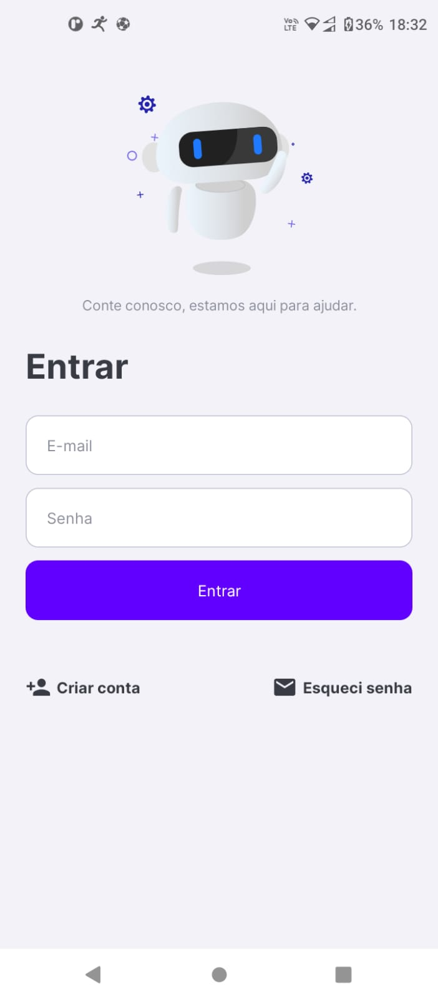
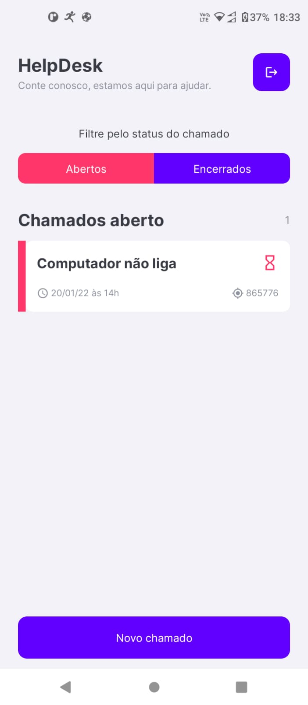
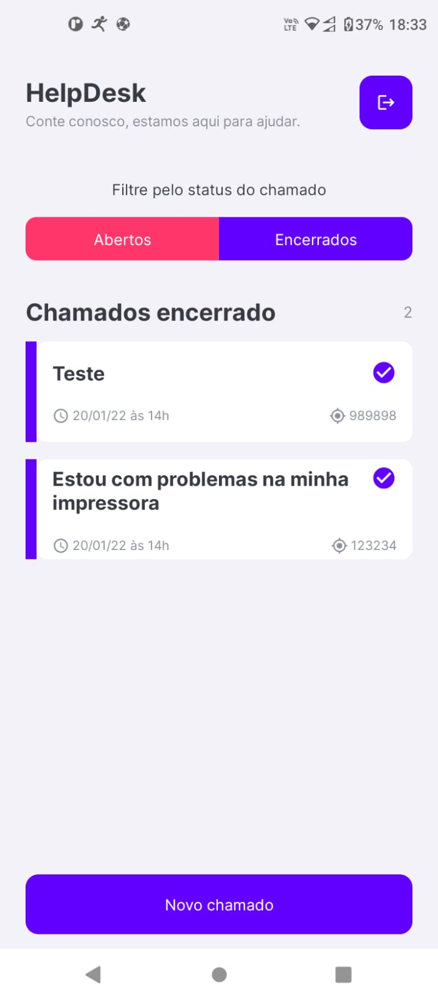
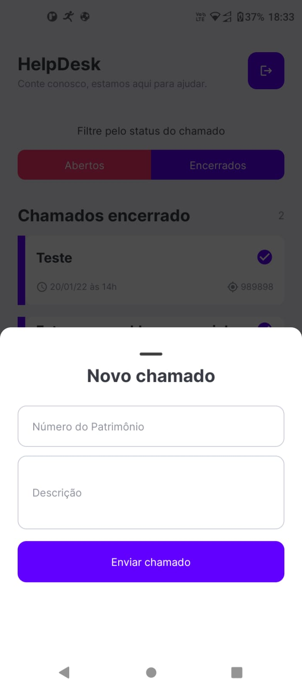

<h1 align="center">
    HelpDesk
</h1>

<h4 align="center">
  ☕ Projeto desenvolvido um CodeDrop feito pela Rockeseat
</h4>

 

  
  
  
  

## 💻 Projeto
O HelpDesk foi um projeto desenvolvido durante uma live feita pela Rocketseat, onde o intuíto dessa live foi mostrar a integração de um backend as a service com um projeto React Native

## :rocket: Tecnologias

Tecnologias utilizadas no projeto:

- [React Native](https://facebook.github.io/react-native/)
- [Expo](https://expo.io/)
- [Firebase](https://firebase.google.com/?hl=pt-br)
- [React Native Firebase](https://rnfirebase.io/)

## Funcionalidades da aplicação

- Cadastro de usuário
- Funcionalidade de esqueci minha senha
- Autenticação de usuário
- Listagem de chamados com filtro de chamados abertos e fechados
- Cadastro de chamados

## 🚀 Instalação do Mobile
1. Rode o comando `yarn` para instalar todas as dependências necessárias
2. Com o celular conectado no computador e o debug usb ativado rode o comando `yarn android` para executar a aplicação

## 🤔 Como contribuir

- Faça um fork desse repositório;
- Cria uma branch com a sua feature: `git checkout -b minha-feature`;
- Faça commit das suas alterações: `git commit -m 'feat: Minha nova feature'`;
- Faça push para a sua branch: `git push origin minha-feature`.

Depois que o merge da sua pull request for feito, você pode deletar a sua branch.

## :memo: Licença

Esse projeto está sob a licença MIT. Veja o arquivo [LICENSE](LICENSE.md) para mais detalhes.

---